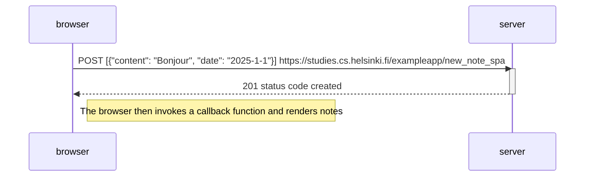

```mermaid

sequenceDiagram

    participant browser
    participant server

    browser->>server: POST [{"content": "Bonjour", "date": "2025-1-1"}] https://studies.cs.helsinki.fi/exampleapp/new_note_spa
    activate server
    server-->>browser: 201 status code created
    deactivate server

    Note right of browser: The browser then invokes a callback function and renders notes

```