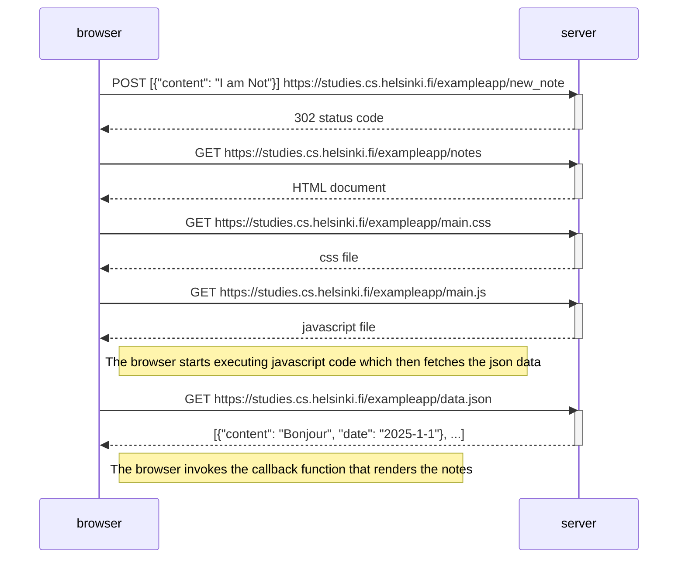

My first flow chart using mermaid on Github:

```mermaid
sequenceDiagram

    participant browser
    participant server

    browser->>server: POST [{"content": "I am Not"}] https://studies.cs.helsinki.fi/exampleapp/new_note
    activate server
    server-->>browser: 302 status code
    deactivate server

    browser->>server: GET https://studies.cs.helsinki.fi/exampleapp/notes
    activate server
    server-->>browser: HTML document
    deactivate server

    browser->>server: GET https://studies.cs.helsinki.fi/exampleapp/main.css
    activate server
    server-->>browser: css file
    deactivate server

    browser->>server: GET https://studies.cs.helsinki.fi/exampleapp/main.js
    activate server
    server-->>browser: javascript file
    deactivate server

    Note right of browser: The browser starts executing javascript code which then fetches the json data

    browser->>server: GET https://studies.cs.helsinki.fi/exampleapp/data.json
    activate server
    server-->>browser: [{"content": "Bonjour", "date": "2025-1-1"}, ...];
    deactivate server

    Note right of browser: The browser invokes the callback function that renders the notes

```
